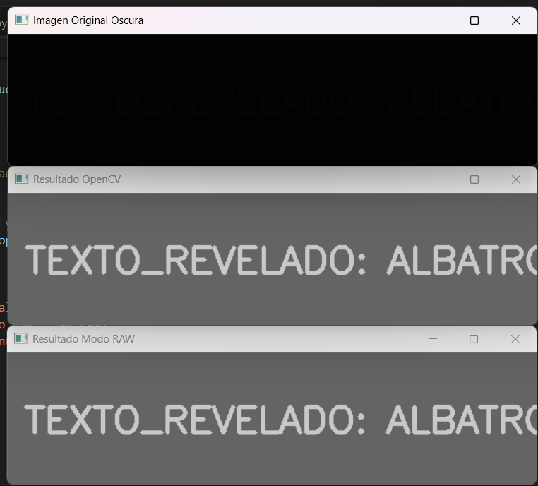
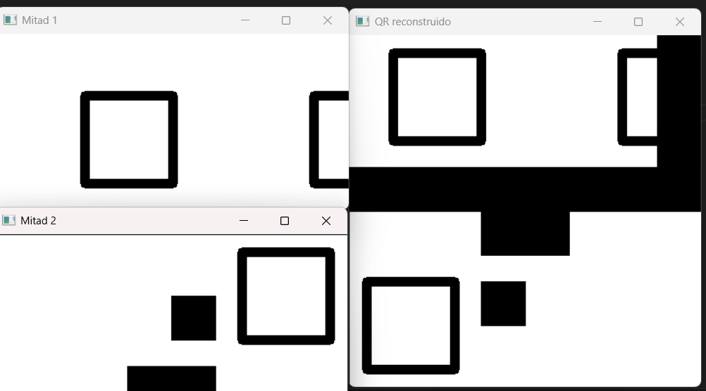
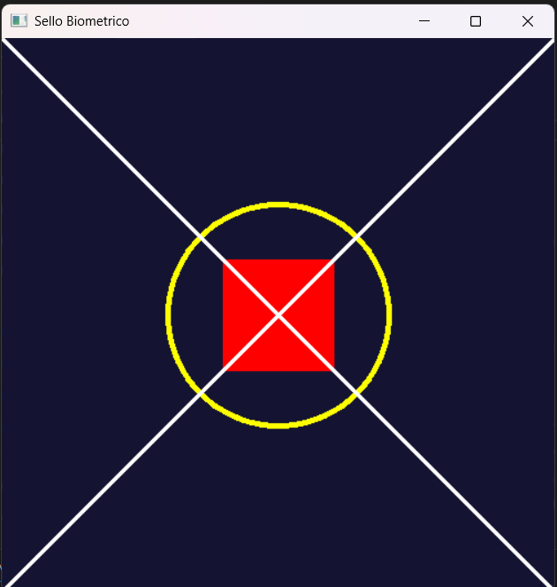
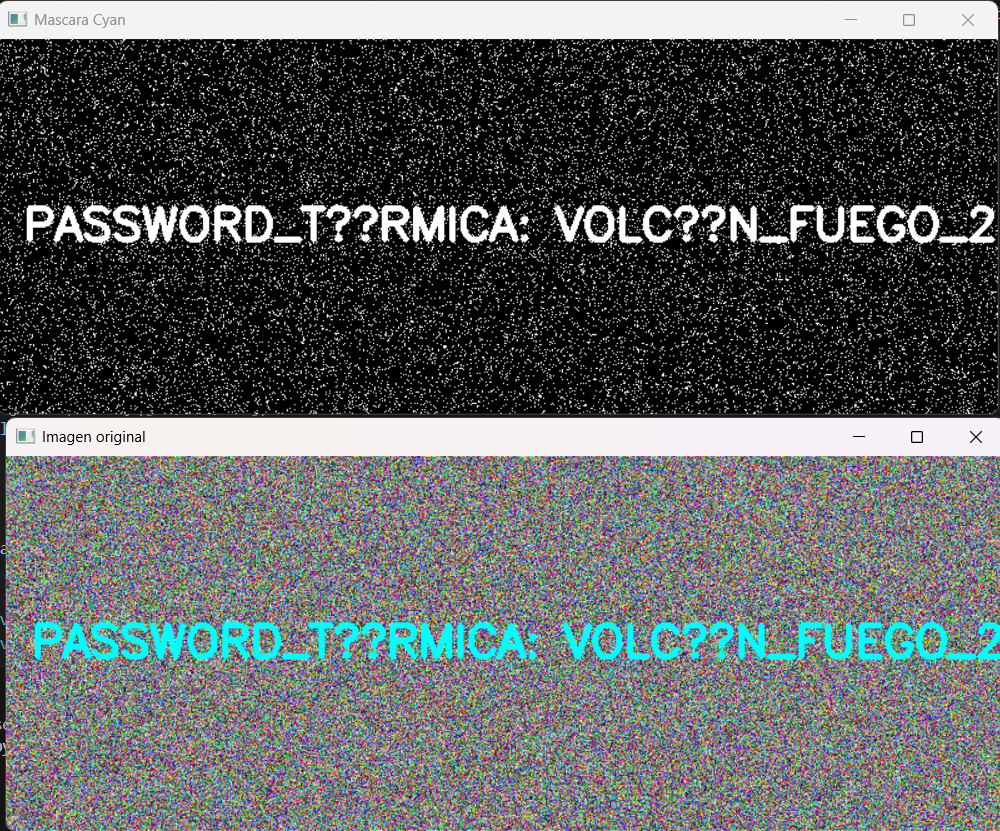
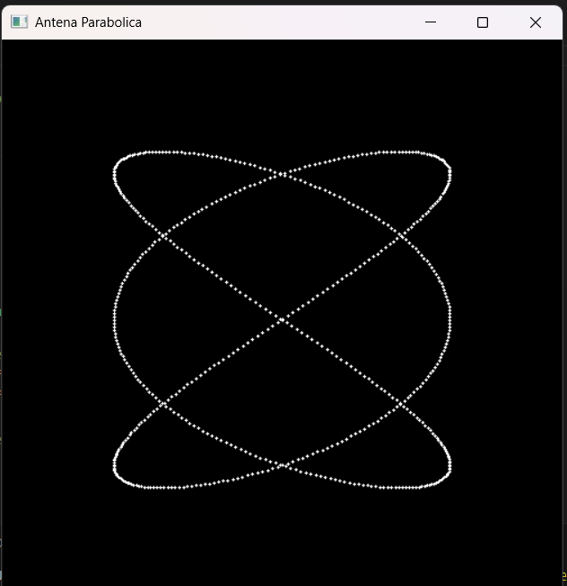

 Reporte de Misión: Graficación Táctica
LAgente Especial: MIGUEL ROJAS SANTILLAN
Materia: Graficación / Procesamiento de Imágenes
Operación: Reconstrucción y análisis de señales visuales

 Evidencias de Misión
 Misión 1: El Mensaje Subexpuesto (Operadores Puntuales)
Objetivo

Recuperar un mensaje oculto dentro de una imagen extremadamente oscurecida aplicando un operador puntual inverso.

Concepto aplicado

Un operador puntual modifica cada píxel de una imagen de forma independiente usando una operación matemática.

La operación utilizada fue:

𝐼
𝑛
𝑢
𝑒
𝑣
𝑜
=
𝐼
𝑜
𝑟
𝑖
𝑔
𝑖
𝑛
𝑎
𝑙
×
50
I
nuevo
	​

=I
original
	​

×50
Código utilizado
import cv2
import numpy as np

img = cv2.imread('m1_oscura.png', cv2.IMREAD_GRAYSCALE)

alto, ancho = img.shape
img_raw = img.copy()

for i in range(alto):
    for j in range(ancho):

        nuevo = img_raw[i,j] * 50
        nuevo = np.clip(nuevo,0,255)

        img_raw[i,j] = nuevo

img_opencv = np.clip(img * 50,0,255).astype(np.uint8)

cv2.imshow("Original", img)
cv2.imshow("Resultado RAW", img_raw)
cv2.imshow("Resultado OpenCV", img_opencv)

cv2.waitKey(0)
cv2.destroyAllWindows()
Resultado:

 Misión 2: El QR Fragmentado (Transformaciones Geométricas)
Objetivo

Reconstruir un código QR dividido y manipulado mediante transformaciones geométricas.

Conceptos aplicados

Traslación

Rotación

Transformaciones Afines

La mitad inferior fue rotada 180° y ambas mitades fueron posicionadas correctamente en un lienzo de 400x400.

Código
import cv2
import numpy as np

mitad1 = cv2.imread('m2_mitad1.png')
mitad2 = cv2.imread('m2_mitad2.png')

lienzo = np.zeros((400,400,3), dtype=np.uint8)

h1, w1 = mitad1.shape[:2]

M_trans = np.float32([[1,0,-50],[0,1,-50]])
mitad1_corregida = cv2.warpAffine(mitad1, M_trans, (400,400))

lienzo[0:h1,0:w1] = mitad1_corregida[0:h1,0:w1]

h2, w2 = mitad2.shape[:2]

centro = (w2//2, h2//2)

M_rot = cv2.getRotationMatrix2D(centro,180,1)

mitad2_rotada = cv2.warpAffine(mitad2, M_rot, (w2,h2))

lienzo[200:200+h2,0:w2] = mitad2_rotada

cv2.imshow("QR reconstruido", lienzo)

cv2.waitKey(0)
cv2.destroyAllWindows()
Resultado

🕵️ Misión 3: El Sello Biométrico (Primitivas de Dibujo)
Objetivo

Construir una figura geométrica específica usando primitivas de dibujo en OpenCV.

Elementos dibujados

Lienzo azul oscuro

Círculo amarillo

Rectángulo rojo sólido

Dos líneas diagonales blancas

Código
import cv2
import numpy as np

lienzo = np.full((500,500,3), (50,20,20), dtype=np.uint8)

cv2.circle(lienzo,(250,250),100,(0,255,255),3)

cv2.rectangle(lienzo,(200,200),(300,300),(0,0,255),-1)

cv2.line(lienzo,(0,0),(500,500),(255,255,255),2)
cv2.line(lienzo,(500,0),(0,500),(255,255,255),2)

cv2.imwrite("m3_sello_forjado.png", lienzo)

cv2.imshow("Sello", lienzo)

cv2.waitKey(0)
cv2.destroyAllWindows()
Resultado

🕵️ Misión 4: La Frecuencia Térmica (Modelo HSV)
Objetivo

Eliminar el ruido visual de una imagen para revelar un mensaje oculto usando el modelo de color HSV.

Concepto aplicado

El modelo HSV separa:

Canal	Significado
Hue	tipo de color
Saturation	intensidad
Value	brillo

Esto permite detectar colores específicos fácilmente.

Código
import cv2
import numpy as np

img = cv2.imread('m4_ruido.png')

hsv = cv2.cvtColor(img, cv2.COLOR_BGR2HSV)

bajo = np.array([80,100,100])
alto = np.array([100,255,255])

mascara = cv2.inRange(hsv,bajo,alto)

cv2.imshow("Original", img)
cv2.imshow("Mascara", mascara)

cv2.waitKey(0)
cv2.destroyAllWindows()
Resultado

🕵️ Misión 5: La Antena Paramétrica (Curva de Lissajous)
Objetivo

Dibujar una curva paramétrica usando ecuaciones matemáticas dependientes del parámetro t.

Ecuaciones utilizadas
𝑥
(
𝑡
)
=
250
+
150
sin
⁡
(
3
𝑡
)
x(t)=250+150sin(3t)
𝑦
(
𝑡
)
=
250
+
150
sin
⁡
(
2
𝑡
)
y(t)=250+150sin(2t)

Estas ecuaciones generan una curva de Lissajous.

Código
import cv2
import numpy as np
import math

lienzo = np.zeros((500,500,3), dtype=np.uint8)

t = 0

while t <= 2*math.pi:

    x = 250 + 150*math.sin(3*t)
    y = 250 + 150*math.sin(2*t)

    x = int(x)
    y = int(y)

    cv2.circle(lienzo,(x,y),1,(255,255,255),-1)

    t += 0.01

cv2.imshow("Curva Lissajous", lienzo)

cv2.waitKey(0)
cv2.destroyAllWindows()
Resultado

Análisis del Analista (Reflexiones Finales)
1️ Sobre los Operadores Puntuales (Misión 1)

Si en lugar de multiplicar cada píxel por 50 se hubiera sumado 50, el resultado sería diferente.
Sumar 50 aumentaría el brillo general de la imagen, pero no ampliaría las diferencias entre los valores de intensidad de los píxeles. Como los valores originales estaban entre 1 y 5, al sumar 50 solo se obtendrían valores entre 51 y 55, lo que produciría una imagen casi uniforme y con muy poco contraste.

En cambio, multiplicar por 50 amplifica la diferencia entre los valores originales (1→50, 5→250), lo que permite recuperar claramente la información visual del mensaje.

2️ Sobre el Espacio HSV (Misión 4)

El modelo BGR es ineficiente para detectar colores específicos porque cada color depende de la combinación simultánea de tres canales (azul, verde y rojo). Esto hace difícil definir rangos claros para encontrar todos los tonos de un mismo color.

En cambio, el modelo HSV separa el color en tres componentes independientes, donde el canal Hue representa directamente el tipo de color. Gracias a esto, es posible detectar todos los tonos de un mismo color utilizando únicamente un rango de valores en el canal Hue, sin preocuparse demasiado por el brillo o la saturación.

3️ Sobre Ecuaciones Paramétricas (Misión 5)

Las ecuaciones paramétricas son más adecuadas para dibujar formas complejas porque permiten describir simultáneamente las coordenadas 
𝑥
x y 
𝑦
y en función de un mismo parámetro 
𝑡
t. Esto facilita representar curvas cerradas, trayectorias y figuras complejas que no pueden expresarse fácilmente como una función tradicional 
𝑦
=
𝑓
(
𝑥
)
y=f(x).

Además, muchas figuras geométricas importantes en gráficos por computadora, como círculos, espirales o curvas de Lissajous, requieren ecuaciones paramétricas para poder representarse correctamente.