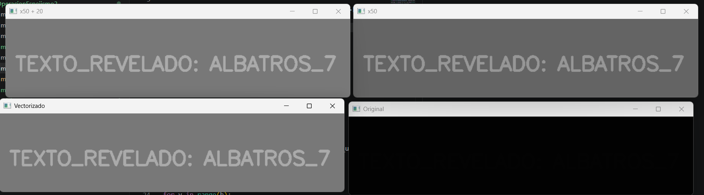
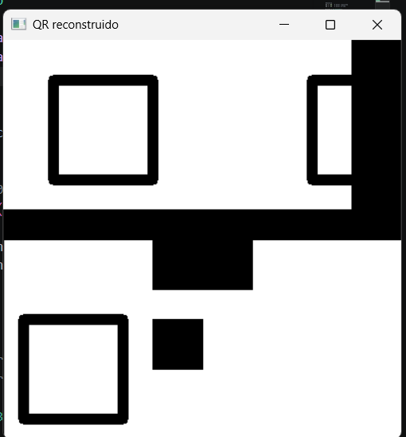
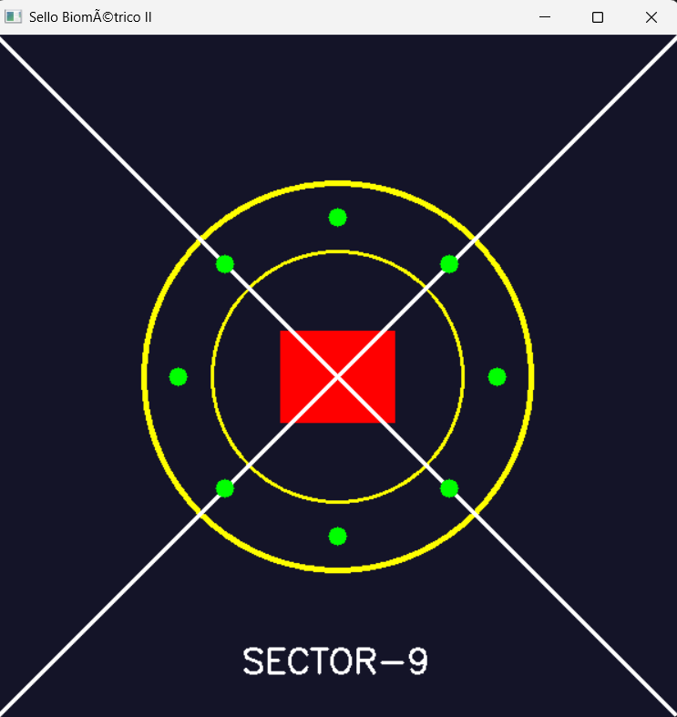
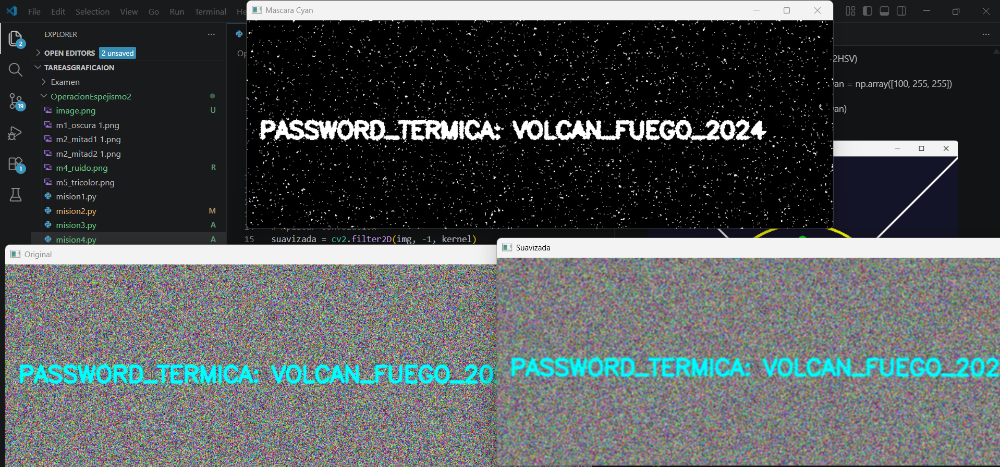
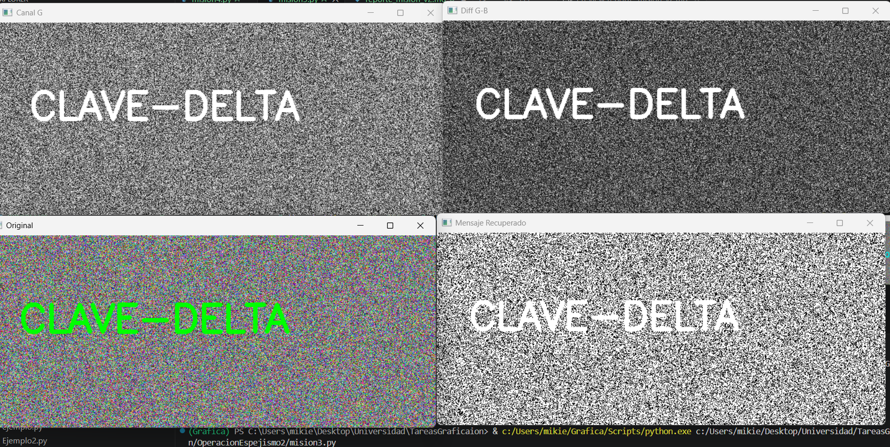

# Misión 1
import cv2
import numpy as np

img = cv2.imread("OperacionEspejismo2/m1_oscura 1.png", cv2.IMREAD_GRAYSCALE)
h, w = img.shape

 Crear matriz 
recuperado = np.zeros((h, w), dtype=np.int32)

#multiplicar por 50
for y in range(h):
    for x in range(w):
        recuperado[y, x] = img[y, x] * 50

#Convertir
recuperado = np.clip(recuperado, 0, 255)
recuperado_uint8 = recuperado.astype(np.uint8)

cv2.imwrite("m1_recuperado_x50.png", recuperado_uint8)

recuperado2 = np.zeros((h, w), dtype=np.int32)

#Sumar +20
for y in range(h):
    for x in range(w):
        recuperado2[y, x] = recuperado_uint8[y, x] + 20

#Convertir
recuperado2 = np.clip(recuperado2, 0, 255)
recuperado2_uint8 = recuperado2.astype(np.uint8)

cv2.imwrite("m1_recuperado_x50_mas20.png", recuperado2_uint8)

vectorizado = np.clip(img * 50 + 20, 0, 255).astype(np.uint8)

cv2.imwrite("m1_vectorizado.png", vectorizado)

#Resultados
cv2.imshow("Original", img)
cv2.imshow("x50", recuperado_uint8)
cv2.imshow("x50 + 20", recuperado2_uint8)
cv2.imshow("Vectorizado", vectorizado)

cv2.waitKey(0)
cv2.destroyAllWindows()

 # Misión 2
QR reconstruido: (inserta aquí)
Código:
import cv2
import numpy as np

mitad1 = cv2.imread("OperacionEspejismo2/m2_mitad1.png")
mitad2 = cv2.imread("OperacionEspejismo2/m2_mitad2.png")

if mitad1 is None or mitad2 is None:
    print("Error cargando imágenes")
    exit()

lienzo = np.full((400, 400, 3), 255, dtype=np.uint8)

h1, w1 = mitad1.shape[:2]
h2, w2 = mitad2.shape[:2]

dx, dy = -50, -30
M_tras = np.float32([[1, 0, dx], [0, 1, dy]])
mitad1_corregida = cv2.warpAffine(mitad1, M_tras, (w1, h1))

x_offset = (400 - w1) // 2
lienzo[0:h1, x_offset:x_offset+w1] = mitad1_corregida

centro = (w2 // 2, h2 // 2)
M_rot = cv2.getRotationMatrix2D(centro, 180, 1)
mitad2_corregida = cv2.warpAffine(mitad2, M_rot, (w2, h2))

x_offset2 = (400 - w2) // 2
lienzo[400-h2:400, x_offset2:x_offset2+w2] = mitad2_corregida

cv2.imwrite("m2_qr_reconstruido.png", lienzo)

# Misión 3
Sello forjado: (inserta aquí)
Código:
import cv2
import numpy as np
import math

img = np.zeros((600, 600, 3), dtype=np.uint8)
img[:] = (40, 20, 20)

cx, cy = 300, 300

cv2.circle(img, (cx, cy), 170, (0, 255, 255), 3)
cv2.circle(img, (cx, cy), 110, (0, 255, 255), 2)

cv2.rectangle(img, (250, 260), (350, 340), (0, 0, 255), -1)

cv2.line(img, (0, 0), (600, 600), (255, 255, 255), 2)
cv2.line(img, (600, 0), (0, 600), (255, 255, 255), 2)

for i in range(8):
    angulo = i * (2 * math.pi / 8)
    x = int(cx + 140 * math.cos(angulo))
    y = int(cy + 140 * math.sin(angulo))
    cv2.circle(img, (x, y), 8, (0, 255, 0), -1)

cv2.putText(img, "SECTOR-9", (180, 560),
            cv2.FONT_HERSHEY_SIMPLEX, 1,
            (255, 255, 255), 2)

cv2.imwrite("m3_sello_forjado_v2.png", img)

# Misión 4
Máscara Cyan: (inserta aquí)
Código:
import cv2
import numpy as np

img = cv2.imread("OperacionEspejismo2/m4_ruido.png")

if img is None:
    print("Error cargando imagen")
    exit()

kernel = np.ones((3, 3), np.float32) / 9
suavizada = cv2.filter2D(img, -1, kernel)

cv2.imwrite("m4_suavizada.png", suavizada)

hsv = cv2.cvtColor(suavizada, cv2.COLOR_BGR2HSV)

lower_cyan = np.array([80, 100, 100])
upper_cyan = np.array([100, 255, 255])

mask = cv2.inRange(hsv, lower_cyan, upper_cyan)

cv2.imwrite("m4_mask_cyan.png", mask)

# Misión 5
Evidencia tricolor: (inserta aquí)
Mensaje recuperado: (inserta aquí)
Código:
import cv2
import numpy as np

img = np.random.randint(0, 256, (300, 700, 3), dtype=np.uint8)

cv2.putText(img, "CLAVE-DELTA", (50, 150),
            cv2.FONT_HERSHEY_SIMPLEX,
            2, (0, 255, 0), 5)

cv2.imwrite("m5_tricolor.png", img)

b, g, r = cv2.split(img)

diff = cv2.absdiff(g, b)
norm = cv2.normalize(diff, None, 0, 255, cv2.NORM_MINMAX)

_, mask = cv2.threshold(norm, 50, 255, cv2.THRESH_BINARY)

cv2.imwrite("m5_mensaje.png", mask)

 # Análisis del Analista (Reflexiones Finales)
Operadores puntuales (M1):
La multiplicación (x50) incrementa el contraste de forma proporcional, haciendo que las diferencias entre píxeles se amplifiquen mejor. La suma (+50) solo aumenta el brillo general, lo que puede “lavar” la imagen y perder contraste.

La multiplicación preserva mejor el contraste del texto.

Transformaciones geométricas (M2):
El centro de rotación es importante porque define cómo gira la imagen. Si el centro es incorrecto, la imagen puede desplazarse o quedar fuera del área visible.

Usar el centro correcto mantiene la imagen alineada y evita distorsiones.

Convolución (M4):
El filtro promedio reduce el ruido suavizando la imagen, lo que evita falsos positivos al segmentar por color. Sin embargo, también difumina los bordes, haciendo que el texto pierda definición.

Ventaja: reduce ruido. Desventaja: borra detalles finos.

Canales (M5):
Separar canales permite analizar cada componente de color individualmente. Un mensaje puede estar oculto en un solo canal y no ser visible en la imagen combinada.

Al aislar o combinar canales, se puede revelar información oculta.